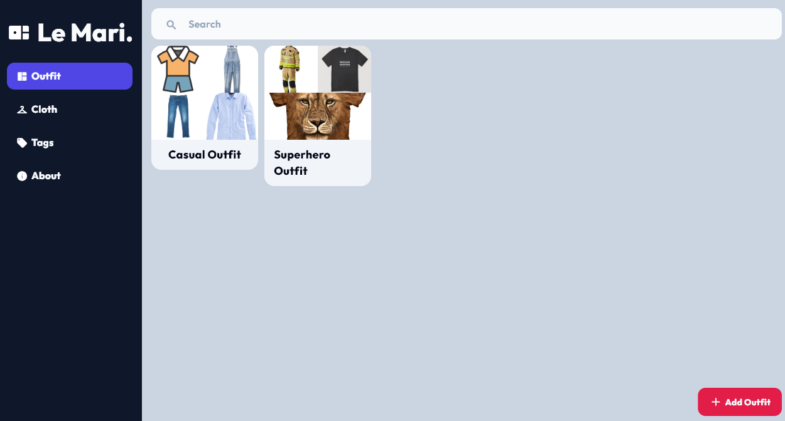
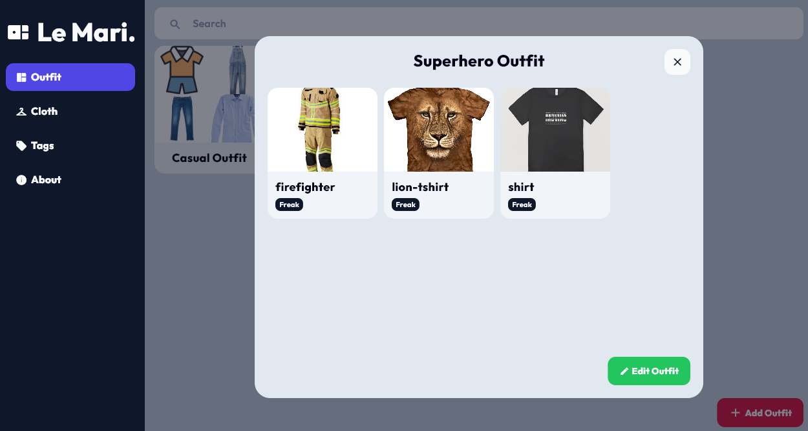
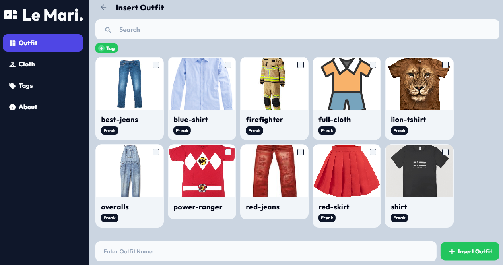
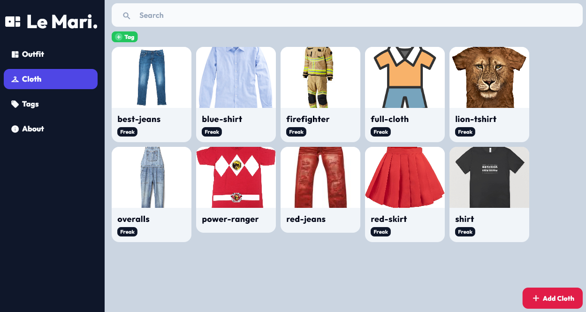
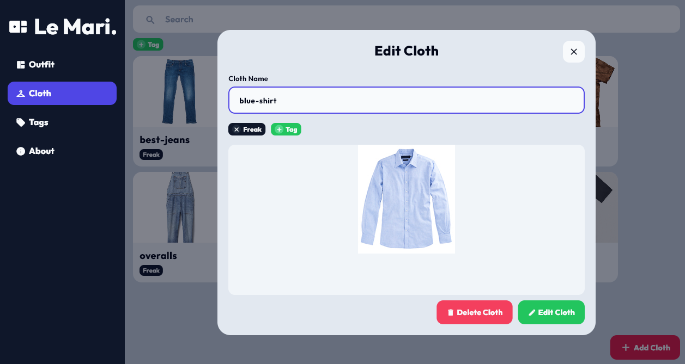
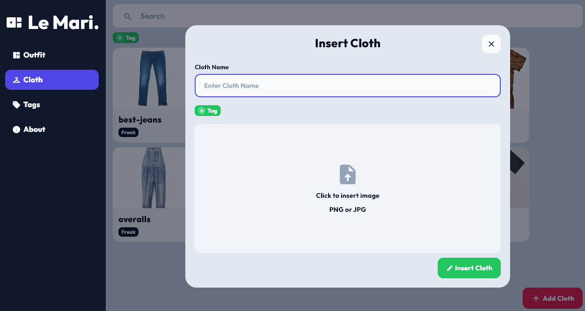
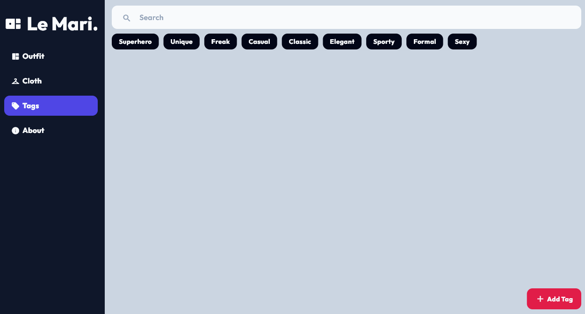
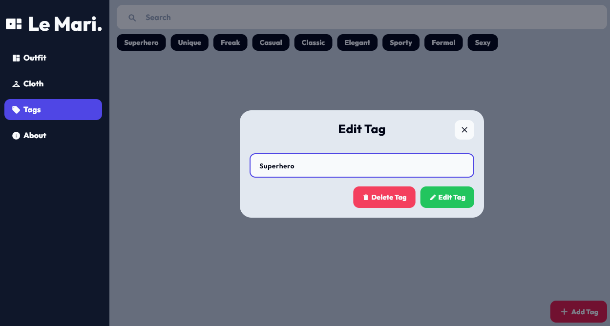
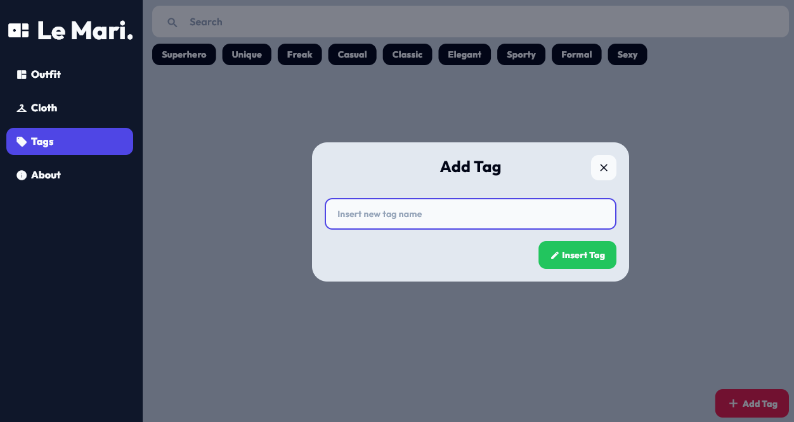

# 👔 Le Mari 👔

## 📋 Deskripsi
**Le Mari** merupakan aplikasi pengelolaan baju terpadu. Aplikasi ini bertujuan untuk mencatat dan memadukan seluruh pakai penggunanya
untuk menghasilkan suatu set pakaian yang cocok bagi berbagai macam kegiatan. Aplikasi ini merupakan aplikasi berbasis desktop.

## 📖 Konten Aplikasi

**Le Mari** memiliki tiga halaman utama, yaitu
### 🤵🏻 Outfit
Halaman outfit menampilkan keseluruhan koleksi baju yang dimiliki oleh pengguna. Koleksi tersebut akan berdasarkan pakaian yang ditambahkan
 oleh pengguna pada laman **Cloth**. Pengguna akan menambahkan, mengedit, dan menghapus koleksi yang dimilikinya 
disini.


*Main View*


*Outfit Edit*


*Outfit Add*

### 👕 Cloth
Halaman cloth menampilkan keseluruhan pakaian yang dimiliki oleh pengguna. Pengguna akan menambahkan, mengedit, dan menghapus pakaian yang dimilikinya 
disini. Setiap pakaian akan memiliki *tag*-nya masing masing yang dapat ditambahkan melalui laman **Tag**


*Main View*


*Cloth Edit*


*Cloth Add*

### 🏷️ Tag
Halaman tag menampilkan keseluruhan tag yang ditambahkan oleh. Pengguna akan menambahkan, mengedit, dan menghapus tag yang dimilikinya 
disini.


*Main View*


*Tag Edit*


*Tag Add*

## 🏃🏻‍♂️ Cara Menjalankan Aplikasi

```
// untuk memasang library
pip install -r requirements.txt

// untuk menjalankan aplikasi
flet run src/main.py
```

```
// untuk memasang library
pip install -r requirements.txt

// untuk kompilasi aplikasi menjadi .exe, file hasil kompilasi berada di folder dist
flet pack src/main.py --name LeMari --add-data src/assets/font/*.ttf:assets/font
```

# 🏬 Database
## Cloth Table
| Column Name | Data Type         | Constraints        |
|-------------|-------------------|--------------------|
| id          | INTEGER           | PRIMARY KEY        |
| name        | TEXT              | NOT NULL, UNIQUE   |
| image_name  | TEXT              | NOT NULL, UNIQUE   |

## Outfit Table
| Column Name | Data Type         | Constraints        |
|-------------|-------------------|--------------------|
| id          | INTEGER           | PRIMARY KEY        |
| name        | TEXT              | NOT NULL, UNIQUE   |

## Cloth-Tag Relationship Table
| Column Name | Data Type         | Constraints        |
|-------------|-------------------|--------------------|
| id          | INTEGER           | PRIMARY KEY        |
| cloth_id    | INTEGER           | FOREIGN KEY (cloth_id) REFERENCES cloth(id) |
| tag_id      | INTEGER           | FOREIGN KEY (tag_id) REFERENCES tag(id) ON DELETE RESTRICT |

## Outfit-Cloth Relationship Table
| Column Name | Data Type         | Constraints        |
|-------------|-------------------|--------------------|
| id          | INTEGER           | PRIMARY KEY        |
| outfit_id   | INTEGER           | FOREIGN KEY (outfit_id) REFERENCES outfit(id) |
| cloth_id    | INTEGER           | FOREIGN KEY (cloth_id) REFERENCES cloth(id) |


# 👯 Contributors
| Contributors                          | NIM       |
|--------------------------------------|----------|
| 13522014 - Raden Rafly Hanggaraksa B  | 13522014  |
| 13522022 - Renaldy Arief Susanto      | 13522022  |
| 13522066 - Nyoman Ganadipa Narayana   | 13522066  |
| 13522068 - Adril Putra Merin          | 13522068  |
| 13522084 - Dhafin Fawwaz Ikramullah   | 13522084  |
| 10023639 - Zulhaqqi Abdul             | 10023638  |

