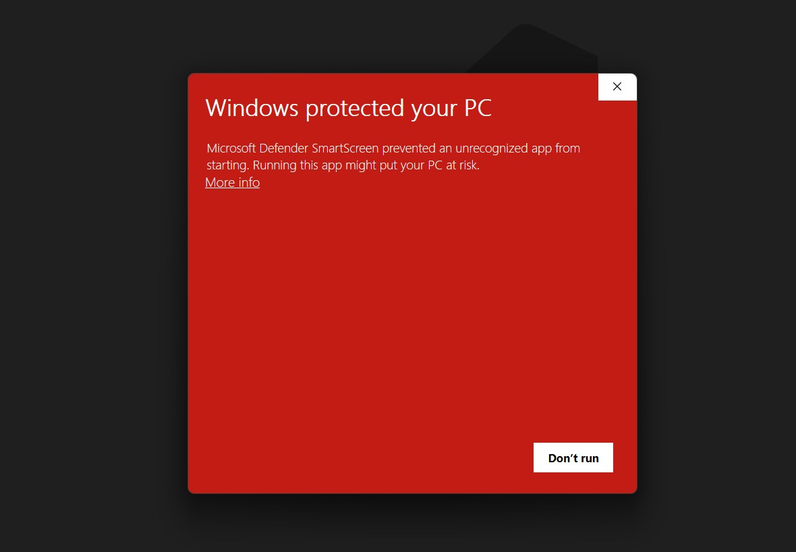
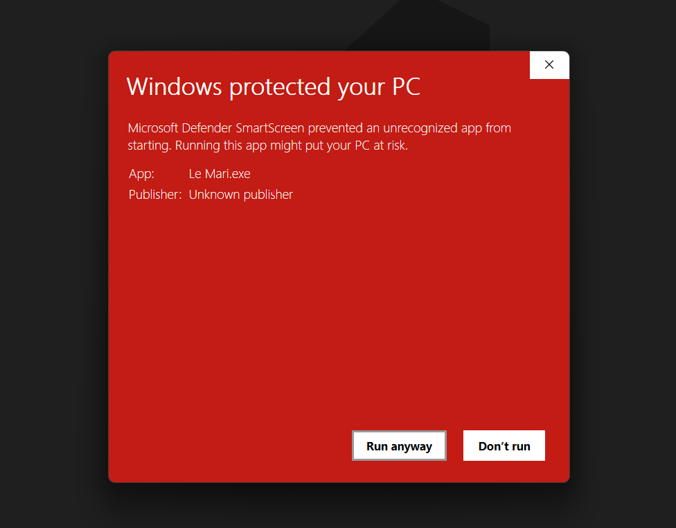

# 👔 Le Mari 👔

## 📋 Deskripsi
**Le Mari** merupakan aplikasi pengelolaan baju terpadu. Aplikasi ini bertujuan untuk mencatat dan memadukan seluruh pakai penggunanya
untuk menghasilkan suatu set pakaian yang cocok bagi berbagai macam kegiatan. Aplikasi ini merupakan aplikasi berbasis desktop.

## 📖 Konten Aplikasi

**Le Mari** memiliki tiga halaman utama, yaitu
### 🤵🏻 Outfit
Halaman outfit menampilkan keseluruhan koleksi baju yang dimiliki oleh pengguna. Koleksi tersebut akan berdasarkan pakaian yang ditambahkan
 oleh pengguna pada laman **Cloth**. Pengguna akan menambahkan, mengedit, dan menghapus koleksi yang dimilikinya 
disini.


*Main View*


*Outfit Edit*


*Outfit Add*

### 👕 Cloth
Halaman cloth menampilkan keseluruhan pakaian yang dimiliki oleh pengguna. Pengguna akan menambahkan, mengedit, dan menghapus pakaian yang dimilikinya 
disini. Setiap pakaian akan memiliki *tag*-nya masing masing yang dapat ditambahkan melalui laman **Tag**


*Main View*


*Cloth Edit*


*Cloth Add*

### 🏷️ Tag
Halaman tag menampilkan keseluruhan tag yang ditambahkan oleh. Pengguna akan menambahkan, mengedit, dan menghapus tag yang dimilikinya 
disini.


*Main View*


*Tag Edit*


*Tag Add*

## 🏃🏻‍♂️ Cara Menjalankan Proyek
### Aplikasi/Build
1. Download executable dari release [Releases](https://gitlab.informatika.org/raflyhangga/if2250-2024-k02-05-le-mari/-/releases)
2. Klik link untuk executable versi terbaru, misalnya [Le Mari v1.0.2](https://drive.google.com/drive/folders/12TPyhd-6h3hgQA9ofeqsyoDVfLQi1Nhe)
3. Setelah dialihkan ke Google Drive, download executable di Google Drive tersebut.
4. Double click file `.exe` yang telah didownload.
5. Jika menggunakan sistem operasi Windows bisa jadi akan muncul pop up windows protection, klik `More Info` <br> 
6. Lalu klik ``Run anyway`` <br> 
7. Jika menggunakan sistem operasi Linux, pastikan memberikan permission terlebih dahulu. Misalnya.
```
chmod +x "./Le Mari.exe"
```
8. Lalu jalankan aplikasi tersebut
```
"./Le Mari.exe"
```

### Development
Direkomendasikan menggunakan virtual environment seperti berikut ini
```
pip install virtualenv
python -m venv .venv
.venv/Scripts/activate.bat
pip install -r requirements.txt
flet run src/main.py
```

Untuk memasang library dependencies, jalankan command berikut ini
```
pip install -r requirements.txt
```

Untuk menjalankan aplikasi selama pengembangan, jalankan command berikut
```
flet run src/main.py
```
Atau
```
python src/main.py
```

Untuk kompilasi aplikasi menjadi .exe, file hasil kompilasi berada di folder dist
```
flet pack src/main.py --name LeMari --add-data src/assets/font/*.ttf:assets/font src/assets/image/*.png:assets/image --icon src/assets/image/favicon.ico
```


# 🏬 Database
## Cloth Table
| Column Name | Data Type         | Constraints        |
|-------------|-------------------|--------------------|
| id          | INTEGER           | PRIMARY KEY        |
| name        | TEXT              | NOT NULL, UNIQUE   |
| image_name  | TEXT              | NOT NULL, UNIQUE   |

## Outfit Table
| Column Name | Data Type         | Constraints        |
|-------------|-------------------|--------------------|
| id          | INTEGER           | PRIMARY KEY        |
| name        | TEXT              | NOT NULL, UNIQUE   |

## Cloth-Tag Relationship Table
| Column Name | Data Type         | Constraints        |
|-------------|-------------------|--------------------|
| id          | INTEGER           | PRIMARY KEY        |
| cloth_id    | INTEGER           | FOREIGN KEY (cloth_id) REFERENCES cloth(id) |
| tag_id      | INTEGER           | FOREIGN KEY (tag_id) REFERENCES tag(id) ON DELETE RESTRICT |

## Outfit-Cloth Relationship Table
| Column Name | Data Type         | Constraints        |
|-------------|-------------------|--------------------|
| id          | INTEGER           | PRIMARY KEY        |
| outfit_id   | INTEGER           | FOREIGN KEY (outfit_id) REFERENCES outfit(id) |
| cloth_id    | INTEGER           | FOREIGN KEY (cloth_id) REFERENCES cloth(id) |


# 👯 Contributors
| Contributors                          | NIM       |
|--------------------------------------|----------|
| 13522014 - Raden Rafly Hanggaraksa B  | 13522014  |
| 13522022 - Renaldy Arief Susanto      | 13522022  |
| 13522066 - Nyoman Ganadipa Narayana   | 13522066  |
| 13522068 - Adril Putra Merin          | 13522068  |
| 13522084 - Dhafin Fawwaz Ikramullah   | 13522084  |
| 10023639 - Zulhaqqi Abdul             | 10023638  |

